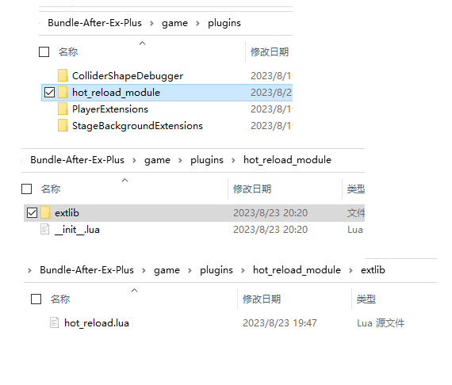

# 热重载组件 By TNW
## 配置
你需要让LuaSTG在启动过程中可以加载 **hot_reload.lua** 。  
eg. 你可以把这个做成插件加载。在 **\_\_init\_\_.lua** 中写入以下内容。

    lstg.plugin.RegisterEvent("afterTHlib", "hot_reload ext", 0, function()
        local reload = lstg.DoFile("extlib/hot_reload.lua")
        reload.init()
    end)
这里的路径是可以自行修改的。   
打开hot_reload.lua后，前几行的配置是可以修改的，如下所示。

    local search_path = "hot_reload/" --添加搜索路径，相对于LuaSTG程序的当前路径，若为空或nil则忽略。你可以将后面需要创建的文件放在这里面。

    local var_path = "variable.lua" --更新时读取的文件，若不存在或加载时出现错误则视作空表。获取变量优先返回这个文件中的值。

    local default_var_path = "variable_default.lua" --初始化时读取的文件，加载的变量的值将作为默认值。若获取的变量不存在则使用这个文件里的作为默认值。

    local enable_fallback = false --是否启用fallback功能。若为true则在更新后会保存/覆盖加载到的变量，当要获取的变量在var_path对应的文件中不存在时，将返回最近一次该变量的值。若依然不存在将抛出错误。
    --注意 启用该功能会增加性能消耗和内存占用。建议在不使用默认值时启用该功能。
    
    local set_fallback_once = true --在上一个功能未启用时，将第一次更新后获取的内容作为fallback。
接下来在LuaSTG启动流程中增加hot_reload的初始化函数。建议添加在GameInit函数中。

    local reload = require("extlib.hot_reload") --路径改为你实际存放的路径
    reload.init()
接下来添加调用更新函数。你可以写在FrameFunc中每帧调用，或者写入imgui调试工具手动调用。

    local reload = require("extlib.hot_reload") --路径改为你实际存放的路径
    reload.update()
**特别提醒:require函数只需要调用一次即可，不要写在多次执行的函数中。**  

## 使用
在你上面写的那个路径里面(如果你没有设置那就是LuaSTG能读取到的地方)创建两个文件，名字分别是你上面设置的两个文件名。里面的内容用以下格式写。

    ......
    return {
        keyname = value,
        key2 = 114514
        ......
    }
当然这个文件也可以执行其他的操作，但最后返回的是一个表。   
接下来在你要调试的地方，用M.get(key)获取对应的value，即：

    local reload = require("extlib.hot_reload") --路径改为你实际存放的路径
    xxx = reload.get("key2") --获取的就是114514
如果要在lstges工程中使用，可以参考如下的方法：

## 配置样例
以插件形式加载

初始化

每帧更新
